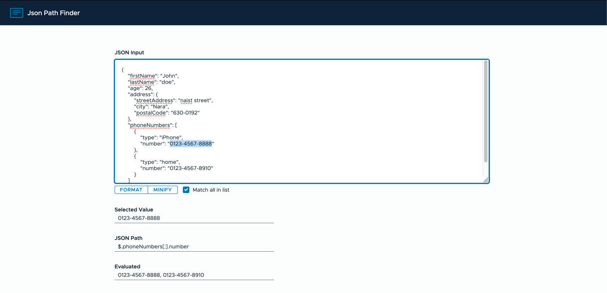

# JSON Path Finder

JSON Path Finder is a user-friendly tool designed to simplify the process of finding JSON paths within a document. It provides an intuitive interface where you can paste a JSON document and click on any property. The tool will then calculate and display the JSON path for the selected value.

## How to Use

1. Open the JSON Path Finder in your browser.
2. Paste your JSON document into the provided text area.
3. Click on any property within the pasted JSON document.
4. The tool will calculate and display the JSON path for the selected property.

## Running the Tool Locally

To run JSON Path Finder on your local machine, follow these steps:

1. Clone the repository to your local machine.
2. Navigate to the project directory.
3. Install the necessary dependencies by running `npm install`.
4. Start the development server by running `ng serve`.
5. Open your browser and navigate to `http://localhost:4200/`.

The application will automatically reload if you change any of the source files.

## Building the Project

To build the project, run `ng build`. The build artifacts will be stored in the `dist/` directory.

## Running Tests

- To execute unit tests, run `ng test`. The tests are executed via [Karma](https://karma-runner.github.io).
- To execute end-to-end tests, run `ng e2e`. You need to first add a package that implements end-to-end testing capabilities to use this command.

## Further Help

For more help on the Angular CLI, use `ng help` or check out the [Angular CLI Overview and Command Reference](https://angular.io/cli) page.
